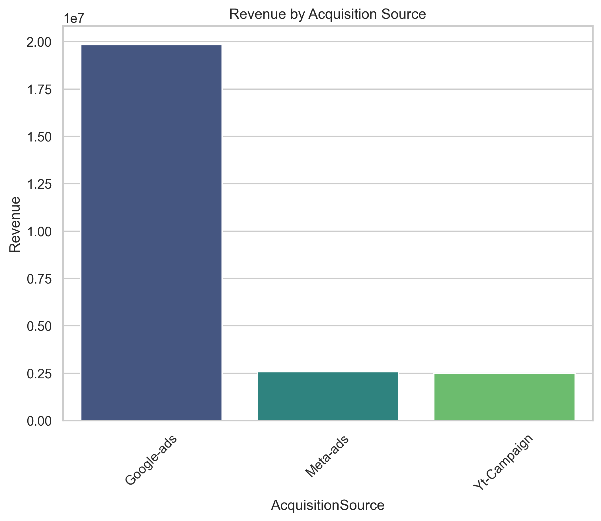
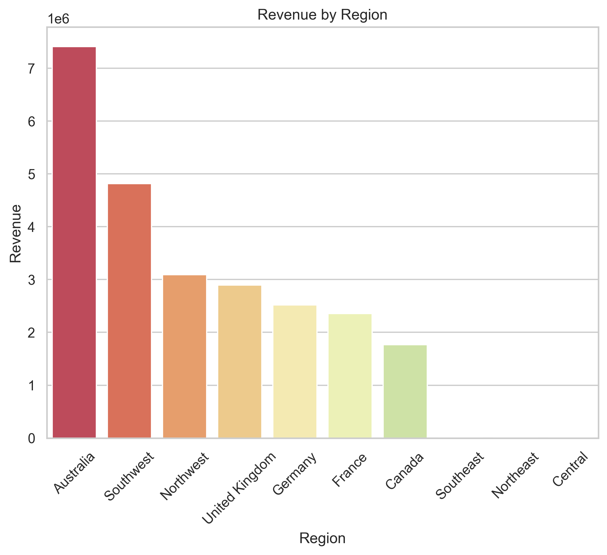
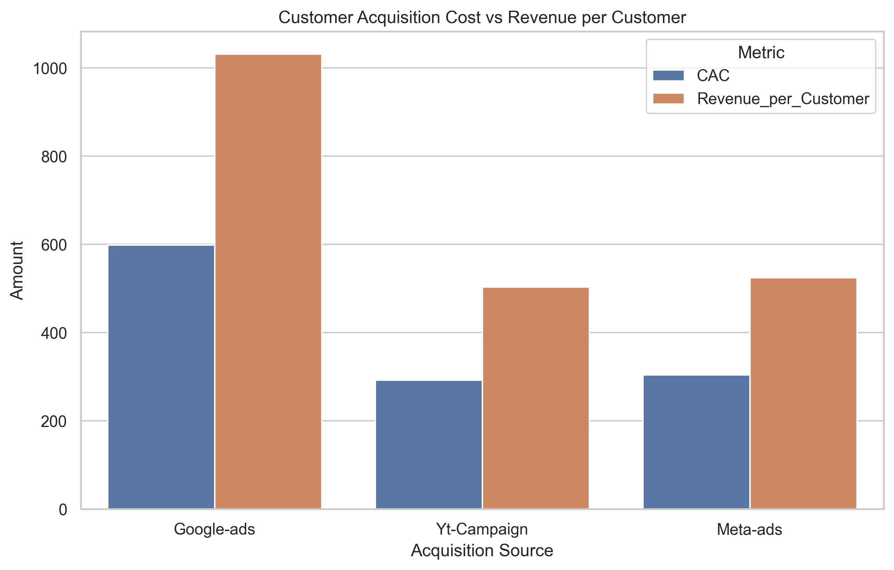
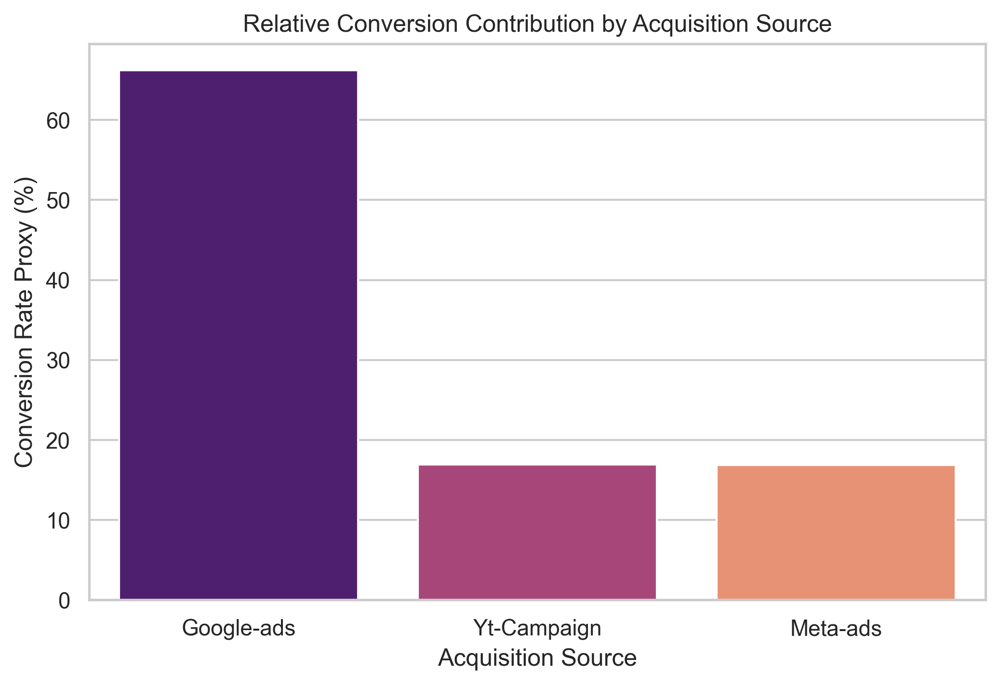
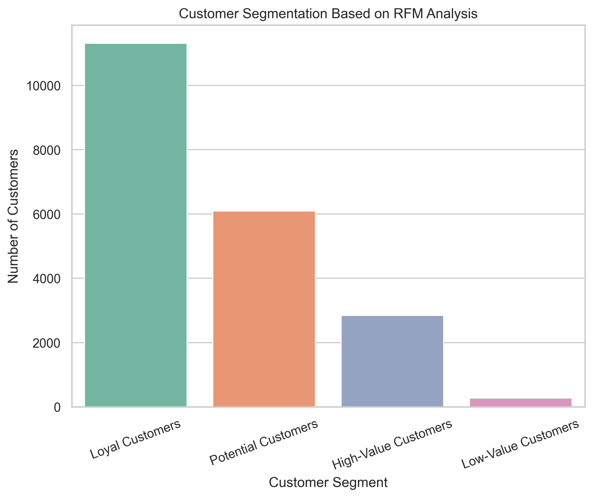

# Marketing Campaign Performance Analysis

## 📊 Project Overview

This project delivers a comprehensive, end-to-end analysis of marketing performance, customer behavior, product trends, and financial risk using transactional and campaign-level data. The analysis aims to enable data-driven decision-making by identifying the most profitable marketing campaigns and acquisition channels, uncovering best-selling products, segmenting customers based on behavior, and evaluating financial performance and payment security risks.

**Project Type:** Business Intelligence & Marketing Analytics  
**Industry Domain:** E-commerce (Plant Retail)  
**Analysis Period:** January 2020 - December 2022

---

## Business Problem & Objectives

The organization needed to optimize marketing spend, improve customer targeting, and mitigate financial risks. Specifically, the project addressed the following critical business questions:

### Primary Objectives

1. **Channel Performance Analysis** - Evaluate acquisition sources (Google Ads, Meta Ads, YouTube Campaign) based on order volume, revenue, and profit contribution
2. **Marketing Profitability Assessment** - Calculate revenue, cost, and profit margins by acquisition source, product category, and region
3. **Product Portfolio Optimization** - Identify best-selling and high-revenue products to inform inventory and merchandising strategies
4. **Temporal Trend Analysis** - Examine sales patterns over time to detect seasonality and anomalies
5. **Customer Segmentation** - Segment customers using RFM (Recency, Frequency, Monetary) analysis for targeted marketing
6. **Financial Performance Evaluation** - Analyze transaction volumes, revenue streams, and profitability across dimensions
7. **Fraud & Payment Risk Assessment** - Identify fraud patterns across payment methods, card types, and regions
8. **CAC & Conversion Analysis** - Determine the most cost-efficient acquisition channels for budget allocation

---

## 📁 Dataset Description

### Data Structure
- **Records:** 55,910 order line items
- **Time Period:** January 2020 - December 2022
- **Dimensions:** 18 features across 5 key domains

### Key Dimensions

| Domain | Features |
|--------|----------|
| **Order Information** | OrderID, OrderLineItem, OrderQuantity, OrderDate |
| **Customer Information** | CustID, Customer_Name, Gender |
| **Product Information** | ProductSKU, Product_Category, ProductCost, ProductPrice |
| **Marketing Information** | AcquisitionSource (Google-ads, Meta-ads, Yt-Campaign) |
| **Financial & Payment** | TransactionID, PaymentMethod, CardType, Fraud |
| **Geographic Information** | Region, Country |

### Product Categories
- **Plants** - Core product line
- **Plant Care & Seeds** - Complementary products
- **Pots** - Accessories

### Data Quality
- **Missing Data Handled:** OrderDate (60%), CardType (9.3%), Customer_Name, ProductPrice, AcquisitionSource
- **Data Cleaning:** Gender standardization, duplicate removal, outlier correction
- **Feature Engineering:** Revenue, Cost, Profit, Customer segments (RFM), Monthly trends

---

## Methodology & Analytical Approach

### 1. Data Preparation
- **Data Extraction:** CSV import and initial exploration
- **Data Cleaning:** 
  - Corrected data types (ProductPrice, OrderDate, Fraud)
  - Handled missing values using mode/median imputation
  - Standardized gender categories
  - Removed invalid records (e.g., CustID = 'R')
- **Feature Engineering:**
  - Calculated Revenue = ProductPrice × OrderQuantity
  - Calculated Cost = ProductCost × OrderQuantity
  - Calculated Profit = Revenue - Cost

### 2. Exploratory Data Analysis (EDA)
- **Descriptive Statistics:** Summary statistics for all numerical features
- **Univariate Analysis:** Distribution analysis for key metrics
- **Bivariate Analysis:** Relationship exploration between variables
- **Time Series Analysis:** Temporal pattern identification

### 3. Customer Segmentation
- **RFM Analysis:** Recency, Frequency, Monetary scoring (1-4 scale)
- **Segment Definition:**
  - High-Value Customers (RFM Score ≥ 10)
  - Loyal Customers (RFM Score 7-9)
  - Potential Customers (RFM Score 5-6)
  - Low-Value Customers (RFM Score < 5)

### 4. Marketing Performance Analysis
- **Channel Metrics:** Orders, customers, revenue, profit, CAC, ROI
- **Conversion Proxies:** Transaction-based conversion rates
- **Efficiency Metrics:** Revenue per customer, profit per customer, ROI per customer

### 5. Risk Assessment
- **Fraud Rate Calculation:** (Fraudulent Transactions / Total Transactions) × 100
- **Risk Segmentation:** By payment method, card type, and region

---

## Key Insights & Findings

### 1. Acquisition Channel Performance

**Finding:** Google Ads dominates all performance metrics, contributing 80% of total revenue.

| Channel | Revenue | Customers | Orders | Market Share |
|---------|---------|-----------|--------|--------------|
| Google Ads | $19.8M | 19,239 | 23,047 | 80% |
| Meta Ads | $2.6M | 4,905 | 5,134 | 10% |
| YouTube Campaign | $2.5M | 4,921 | 5,161 | 10% |

**Business Implication:** While Google Ads is highly successful, the 80/20 concentration presents channel dependency risk.

---

### 2. Marketing Profitability

**Finding:** Profit margins are nearly identical across all channels (~42%), indicating performance differences are volume-driven, not efficiency-driven.

| Channel | Revenue | Cost | Profit | Profit Margin |
|---------|---------|------|--------|---------------|
| Google Ads | $19.8M | $11.5M | $8.3M | 41.98% |
| Meta Ads | $2.6M | $1.5M | $1.1M | 41.96% |
| YouTube Campaign | $2.5M | $1.4M | $1.0M | 41.96% |

**Business Implication:** All channels operate under similar cost structures; scaling opportunities exist for Meta Ads and YouTube Campaign.

---

### 3. Product Performance

**Finding:** Plants category generates 94% of total revenue, positioning it as the core business driver.

| Product Category | Revenue | Orders | Quantity Sold | Revenue Share |
|------------------|---------|--------|---------------|---------------|
| Plants | $23.6M | 13,913 | 13,913 | 94% |
| Plant Care & Seeds | $904K | 16,936 | 57,634 | 4% |
| Pots | $365K | 6,959 | 12,406 | 2% |

**Business Implication:** Heavy reliance on a single category; bundling opportunities exist to increase AOV.

---

### 4. Customer Segmentation (RFM Analysis)

**Finding:** 55% of customers are classified as Loyal, representing a stable revenue base, while 30% are Potential customers ready for conversion.

| Segment | Customers | % of Base | Avg Revenue | Avg Frequency |
|---------|-----------|-----------|-------------|---------------|
| Loyal Customers | 11,314 | 55% | $1,259 | 1.11 |
| Potential Customers | 6,090 | 30% | $141 | 1.00 |
| High-Value Customers | 2,845 | 14% | $3,435 | 2.16 |
| Low-Value Customers | 274 | 1% | $40 | 1.00 |

**Business Implication:** 6,090 Potential customers represent a significant untapped growth opportunity through targeted nurturing.

---

### 5. Geographic Performance

**Finding:** Australia is the dominant market, generating $7.4M (30% of total revenue).

| Region | Revenue | Profit | Orders | Revenue Share |
|--------|---------|--------|--------|---------------|
| Australia | $7.4M | $3.1M | 6,052 | 30% |
| Southwest US | $4.8M | $2.0M | 4,982 | 19% |
| Northwest US | $3.1M | $1.3M | 3,668 | 12% |
| United Kingdom | $2.9M | $1.2M | 2,764 | 12% |
| Germany | $2.5M | $1.1M | 2,288 | 10% |

**Business Implication:** Geographic concentration in Australia and US Southwest; underperforming US regions present growth opportunities.

---

### 6. Fraud & Payment Risk

**⚠️ CRITICAL FINDING:** Fraud rates are 5-7x higher than industry standards (5.0-6.8% vs. <1% benchmark).

| Payment Method | Card Type | Fraud Rate |
|----------------|-----------|------------|
| Credit Card | VISA | 6.84% |
| Credit Card | JCB | 6.67% |
| Credit Card | Mastercard | 6.54% |
| PayPal | AMEX | 6.41% |
| Credit Card | Discover | 6.37% |

**Business Implication:** Immediate fraud mitigation required; estimated $450K annual savings potential with improved security protocols.

---

### 7. Customer Acquisition Economics

**Finding:** Google Ads has the highest CAC ($598) but generates the highest revenue per customer ($1,031), maintaining competitive ROI.

| Channel | CAC | Revenue/Customer | Profit/Customer | ROI |
|---------|-----|------------------|-----------------|-----|
| Google Ads | $598 | $1,031 | $433 | 0.723 |
| YouTube Campaign | $292 | $504 | $211 | 0.723 |
| Meta Ads | $304 | $524 | $220 | 0.723 |

**Business Implication:** Despite 2x higher acquisition cost, Google Ads attracts customers who spend 2x more, justifying premium investment.

---

## 📈 Visualizations & Business Insights

### 1. Revenue by Acquisition Source

**Insight:** Google Ads generates $19.8M (80% of revenue), nearly 8x more than Meta Ads and YouTube Campaign combined. This extreme concentration identifies Google Ads as the primary revenue engine but also highlights over-dependence risk requiring channel diversification strategy.

---

### 2. Top Products by Revenue

**Insight:** Plants category dominates with $23.6M (94% of revenue), 26x more than Plant Care & Seeds. This concentration positions the business as a plant-focused retailer with significant bundling opportunities to increase average order value through complementary products.

---

### 3. Monthly Revenue Trends by Product Category

**Insight:** January 2022 shows anomalous $15M spike (63% of annual Plants revenue), contrasting with stable $200K-500K monthly baseline. This pattern suggests either a major promotional campaign, bulk order fulfillment, or data recording irregularity requiring investigation for potential replication or correction.

---

### 4. Revenue by Region

**Insight:** Australia leads with $7.4M (30% of total), followed by US Southwest ($4.8M) and Northwest ($3.1M). Six markets contribute 96% of revenue while Southeast/Northeast/Central US generate <$12K combined, indicating significant geographic expansion opportunity in underperforming regions.

---

### 5. Fraud Rate Heatmap by Payment Method & Card Type

**Insight:** All payment combinations show 5.0-6.8% fraud rates—alarmingly 5-7x above industry standard (<1%). Credit cards average 6.5% fraud vs. PayPal's 5.5%, with VISA credit cards highest at 6.8%. Uniform rates across card types suggest payment gateway vulnerability rather than card-specific issues, requiring immediate 3D Secure implementation.

---

### 6. Customer Acquisition Cost vs Revenue per Customer

**Insight:** Google Ads has highest CAC ($598) but generates proportionally higher revenue per customer ($1,031) with $433 profit margin. YouTube Campaign and Meta Ads show efficient acquisition ($292-304 CAC) with lower customer value ($504-524 revenue). All channels maintain ~72% ROI, indicating Google Ads' premium cost is justified by attracting higher-spending customers.

---

### 7. Conversion Contribution by Acquisition Source

**Insight:** Google Ads contributes 66% of customer acquisitions—4x more than YouTube Campaign (17%) and Meta Ads (17%) combined. This distribution aligns with revenue dominance but highlights single-channel over-reliance risk. Near-equal split between YouTube and Meta suggests similar operational scale and effectiveness.

**Methodological Note:** Due to the absence of impression/click data, conversion rates use transaction-based proxies (customers with ≥1 completed order). While not a true funnel conversion, metrics provide a reliable basis for relative comparison and budget allocation.

---

### 8. Customer Segmentation Based on RFM Analysis

**Insight:** Loyal Customers dominate at 11,314 (55% of base), nearly double Potential segment (6,090, 30%) and quadruple High-Value segment (2,845, 14%). Low-Value customers are minimal (274, 1%), indicating strong acquisition quality. High-Value customers generate $3,435 average revenue vs. $1,259 for Loyal customers, presenting clear upselling opportunities.

**Strategic Implication:** 6,090 Potential customers with limited purchase history represent significant growth opportunity through targeted nurturing campaigns to convert them into Loyal customers.

---

## 🛠️ Tools & Technologies

### Programming & Analysis
- **Python 3.x** - Primary programming language
- **Pandas** - Data manipulation and analysis
- **NumPy** - Numerical computing

### Visualization
- **Matplotlib** - Static visualizations
- **Seaborn** - Statistical graphics
- **Plotly Express** - Interactive visualizations

### Statistical Analysis
- **RFM Analysis** - Customer segmentation methodology

### Development Environment
- **Jupyter Notebook** - Interactive development and documentation
- **Git/GitHub** - Version control and collaboration

---

## 💼 Actionable Business Recommendations

### Priority 1: Immediate Actions (0-30 Days)

#### A. Fraud Mitigation (CRITICAL)
**Problem:** 6.5% fraud rate represents severe financial exposure ($450K annual loss)

**Actions:**
1. Implement enhanced fraud detection systems for credit card transactions
2. Partner with fraud prevention services (Stripe Radar, Sift, Signifyd)
3. Mandate 3D Secure authentication for all credit cards, especially VISA (6.8% fraud)
4. Conduct a forensic analysis of fraudulent transaction patterns

**Expected Impact:** Reduce fraud from 6.5% to <2% within 90 days, save $450K annually

---

#### B. Data Quality Investigation
**Problem:** $15M revenue spike in January 2022 (63% of annual Plants revenue)

**Actions:**
1. Investigate January 2022 anomaly—verify data accuracy
2. If legitimate, document success drivers for replication
3. If anomalous, correct the dataset for accurate forecasting

---

### Priority 2: Revenue Optimization (30-90 Days)

#### C. Channel Diversification & Optimization
**Problem:** 66% customer acquisition dependency on a single channel (Google Ads)

**Actions:**
1. Reduce Google Ads dependency from 66% to 50% over 6 months
2. Increase Meta Ads and YouTube Campaign investment by 50%
3. Test new channels: TikTok Ads, Pinterest, and affiliate marketing
4. Implement full conversion tracking (impressions, clicks, funnel metrics)

**Expected Impact:** 20% revenue growth, reduced single-channel risk

---

#### D. Customer Lifetime Value Maximization
**Problem:** 6,090 Potential customers (30% of base) underutilized; High-Value customers lack premium engagement

**Actions:**

**For Potential Customers (6,090):**
1. Automated email sequences for first-repeat purchases
2. Personalized product recommendations
3. First-purchase incentives on complementary products

**For Loyal Customers (11,314):**
1. Targeted retention programs
2. Cross-sell and upsell campaigns

**For High-Value Customers (2,845):**
1. VIP program with early access to new plants
2. Exclusive seasonal collections
3. Concierge customer service

**Expected Impact:** 15% increase in LTV, 25% churn reduction

---

### Priority 3: Product & Market Expansion (90-180 Days)

#### E. Product Portfolio Optimization
**Problem:** 94% revenue concentration in Plants; low cross-sell of complementary products

**Actions:**
1. Expand Plants inventory—high-margin, rare, trending varieties
2. Launch subscription boxes for recurring revenue
3. Create product bundles: "Starter Kits," "Care Packages."
4. Optimize cross-sell at checkout

**Expected Impact:** 10% increase in AOV, 30% revenue growth for Plant Care & Pots

---

#### F. Geographic Expansion
**Problem:** Underperforming US regions (Southeast, Northeast, Central: <$12K combined)

**Actions:**

**Australia (double-down on success):**
1. 🌍 Increase ad spend by 25%
2. 🌍 Expand product selection for local preferences
3. 🌍 Consider local warehousing for faster delivery

**Underperforming US Regions:**
1. 🌍 Geo-targeted campaigns
2. 🌍 Regional influencer partnerships
3. 🌍 Test regional product preferences

**International Markets (Germany $2.5M, France $2.4M):**
1. 🌍 Scale operations and marketing

**Expected Impact:** 25% revenue growth from geographic optimization

---

### Priority 4: Analytics & Infrastructure (Ongoing)

#### G. Measurement & Attribution Infrastructure
**Actions:**
1. 📊 Implement multi-touch attribution model
2. 📊 Full funnel tracking (impressions → clicks → conversions)
3. 📊 True CAC and conversion rate calculation
4. 📊 Build predictive analytics (churn prediction, LTV forecasting, demand forecasting)
5. 📊 Create executive dashboards for real-time monitoring

---

#### H. Seasonal Planning
**Actions:**
1. 📅 Investigate and replicate January 2022 drivers (if legitimate)
2. 📅 Plan annual mega-sale events
3. 📅 Develop a year-round promotional calendar to smooth revenue volatility

---

## 📊 Expected Business Impact (12-Month Horizon)

| Initiative | Timeline | Expected Impact |
|------------|----------|-----------------|
| Fraud mitigation | 90 days | Save $450K annually, protect brand |
| Channel diversification | 6 months | +20% revenue growth, reduced risk |
| Customer LTV programs | 6 months | +15% LTV, -25% churn |
| Product bundling | 4 months | +10% AOV |
| Geographic expansion | 9 months | +25% revenue growth |
| **TOTAL PROJECTED IMPACT** | **12 months** | **$6M+ additional revenue + $450K fraud savings** |

---

## 🎯 Success Metrics (KPIs to Track)

| Metric | Current | Target | Timeline |
|--------|---------|--------|----------|
| Fraud Rate | 6.5% | <2% | 90 days |
| Google Ads Dependency | 66% | <55% | 6 months |
| Customer Retention | Baseline | +25% | 6 months |
| Average Order Value | Baseline | +10% | 4 months |
| Australia Revenue Growth | $7.4M | +25% | 9 months |
| Underperforming US Regions | <$12K | +200% | 9 months |
| Channel ROI | 0.72 | >0.70 (maintain) | Ongoing |
| Potential → Loyal Conversion | 0% | 30% | 6 months |

---

## ⚠️ Limitations & Assumptions

### Data Limitations

1. **Missing Conversion Funnel Data**
   - No impression or click data available
   - CAC and conversion rates calculated using transaction-based proxies
   - Cannot measure true funnel efficiency or drop-off rates

2. **Limited Marketing Spend Data**
   - Actual campaign budgets are not included in the dataset
   - CAC approximated using total cost/customers acquired
   - ROI calculations based on profit margins, not true marketing spend

3. **Temporal Data Issues**
   - 60% missing OrderDate values (imputed with median)
   - Extreme concentration on January 4, 2022 (requires investigation)
   - Limited historical data for robust time series forecasting

4. **Demographics & Psychographics**
   - Limited customer demographic data (only gender available)
   - No age, income, or location-level socioeconomic data
   - Cannot perform advanced psychographic segmentation

5. **Fraud Data Constraints**
   - Binary fraud flag only (no chargeback status, failure reasons)
   - Cannot analyze fraud patterns at a granular level
   - Limited predictive capability for fraud prevention

---

## Future Work & Enhancements

### 1. Advanced Marketing Attribution
- Integrate impression, click, and conversion funnel data
- Implement multi-touch attribution modeling
- Calculate true CAC, CPA, and ROAS metrics
- A/B test campaigns for optimization

### 2. Predictive Analytics & Machine Learning
- **Customer Churn Prediction:** Identify at-risk customers for proactive retention
- **Customer Lifetime Value Forecasting:** Predict future value by segment
- **Product Demand Forecasting:** Time series models for inventory optimization
- **Fraud Detection Models:** Real-time fraud prediction using transaction patterns

### 3. Enhanced Customer Intelligence
- Integrate age, income, psychographic data for deeper segmentation
- Build lookalike models to identify high-value customer profiles
- Implement propensity modeling for cross-sell/upsell
- Develop next-best-action recommendation engine

### 4. Financial Risk Management
- Integrate chargeback data and payment authorization details
- Build risk scoring models by customer, product, and region
- Implement real-time transaction monitoring
- Develop fraud prevention automation

### 5. Product & Inventory Optimization
- Analyze product-level performance (currently aggregated by category)
- Integrate external market signals (seasonality, trends, competitor data)
- Build SKU-level demand forecasting
- Optimize pricing and promotion strategies

### 6. Geographic Market Intelligence
- Analyze regional preferences and buying patterns
- Evaluate market expansion opportunities with market sizing
- Optimize supply chain and fulfillment by region
- Develop region-specific marketing strategies

---

## 📞 Contact & Collaboration

**Project Author:** Harrison Gogo
**LinkedIn:** https://www.linkedin.com/in/gogo-harrison
**Email:** gogoharrison66@gmail.com

### Contributing
This project is open for collaboration. If you have suggestions for improvements or would like to contribute:
1. Fork the repository
2. Create a feature branch (`git checkout -b feature/improvement`)
3. Commit changes (`git commit -m 'Add improvement'`)
4. Push to branch (`git push origin feature/improvement`)
5. Open a Pull Request

---

## 📜 License

This project is licensed under the MIT License - see the [LICENSE](LICENSE) file for details.

---

## 🙏 Acknowledgments

- Dataset provided by Meriskill
- Analysis conducted for Meriskill marketing optimization initiative
- Special thanks to the Stakeholders at Meriskill for guidance and feedback

---

**⭐ If you found this analysis valuable, please consider giving it a star!**

**Last Updated:** January 2026
